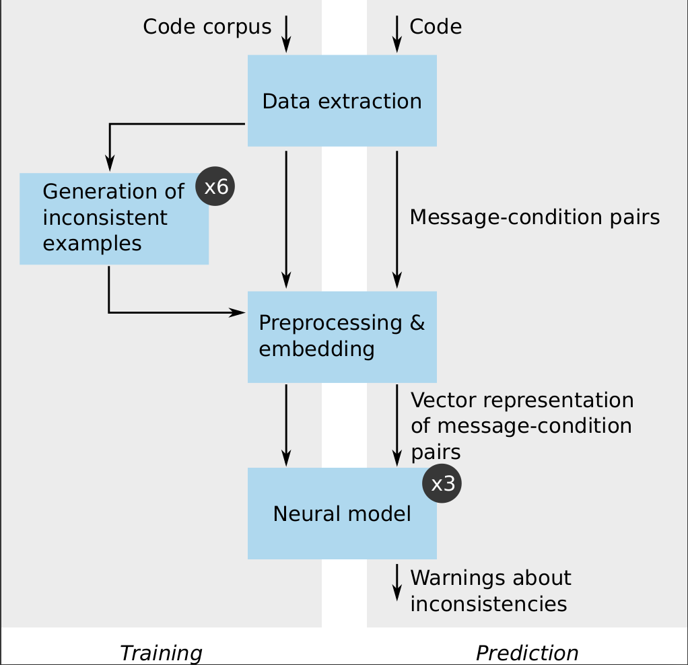

# CMI-Finder
This artifact is a full functional and reusable implementation of the approach and results presented in the paper ["When to Say What: Learning to Find Condition-Message Inconsistencies"](https://drive.google.com/file/d/15owjJPBpH5y12mjIcFYfcDQk7UvnCOwk). The goal of CMI-Finder is to automatically detect condition-message inconsistencies. An example of condition message inconsistency is given below where the operator "or" in the condition is inconsistent with the logic of the message (or --> and):
```Python
if len(bits) != 4 or len(bits) != 6 :
    raise template.TemplateSyntaxError("%r takes exactly\
        four or six arguments (second argument must be ’\
            as’)" % str(bits[0]))
```
The package includes all of the data and code used in the study.

## How to use the artifact?
You can import and test the artificat in two ways:
1. [In our shared docker](#docker-setup)
2. [As a pyhon package through command line](#python-package-setup)

Then you can refer to [Usage](#usage) instruction on how to use our framework.
Finally, in [Data Folders](#data-folders) you find an overview of the shared data that come with this artificat.

## Docker setup
Before you start this setup, make sure docker is installed on your host machine. If not, please refer to: https://docs.docker.com/get-docker/

### Step 1: Load image
Load the docker image that we share in the folder dockers at the root of repository.
```
docker image load -i ./dockers/cmi.image
```
### Step 2: run and attach
```
docker container start --attach -i cmi.image:v1
```

### Step 3 : activate the virtual environement
The user is supposed to be inside the docker after step 2.
```
cd /home/CMI-Finder
source .venv/bin/activate
```

## Python package setup
We assume you already have Python3.8 installed on your machine.
In your host machine, navigate to the root of this repository and execute the following:

<b>Note:</b> Do not run these steps inside our shared docker image, it's already setup.
 ### Step 1: 
 create a new virtual environment using python3.8 or higher. In the following example, we create a virtual environement named .venv
 ```
 python3.8 -m venv .venv
 ```
 ### Step 2: 
 activate the environement (make sure you are in the parent directory of .venv)
 ```
 source .venv/bin/activate
 ```
 ### Step 3: 
 install requirements by using our requirements.txt file located at the root of this repository
 ```
 pip install --upgrade pip
 pip install -r requirements.txt
 ```

 ### step 4:
 install our package cmi-finder
 ```
 pip install .
 ```

 ### step 5:
  For first time setup, you need to download nltk data files because:

 ```
python src/data_generation/nltk_setup.py
```
## Usage
After setting up your environement, whether in Docker image or by installing the python package, make sure you are inside the folder CMI-Finder when executing the following commands.

The components of CMI-Finder are presented in the below figure . For each component of CMI-Finder, we give the command to interract with the component.
### **Data collection**
In this step, cmi-finder either scrapes randomly a configurable number of repositories or it clones a list of repositories given by the user in a text file.

First, let's a create a folder destination for the cloned repos:
```
mkdir -p demo_repos
```

***Executing one of the following options will prompt you to give a github user name and a corresponding token to scrape repositories.***

* <b>Option1: Scraping random repositories from GitHub. </b>The following command will scrape 20 repos randomly from github and save them in ./demo_repos
    ```
    python -m data_collection.scrape --strategy random --size 20 --output ./demo_repos
    ```
* <b> Option2: Scraping a list of repositories from GitHub. </b> The following command will scrape the list of repositories given in the file target_repos.txt and save them to the folder ./output_folder

    ```
    python -m data_collection.scrape --strategy list --strategy_arg ./demo_repos/target_repos.txt --output ./demo_repos
    ```

<b>Note: </b> all the used folders should exist priorly

### **Data extraction**
In this step cmi-finder extracts functions from all python files given in a directory and all its subtree then extracts condition-message statements from those functions.

First let's create a folder destination where to save the output data.
```
mkdir -p demo_data
```

* <b> Step1: Extract functions. </b>
The following command extracts all functions from all python files in the tree of folder ./demo_repos and outputs the results into the folder ./demo_data

    ```
    python -m data_collection.extract_functions --source ./demo_repos --output ./demo_data
    ```

* <b>Step2: Extract statements. </b>
The following command will extract condition-message statements from the list of functions saved in the file ./demo_data/extracted_functions.json using 16 cpus then saves it to the folder ./demo_data

    ```
    python -m data_collection.extract_data --source ./demo_data/extracted_functions.json -n 16 --output ./demo_data
    ```

### **Data generation**
In this step, cmi-finder generates inconsistent condition-message statements from the previously collected likely consistent statements. cmi-finder offers 6 generation techniques. You can invoke all of them at once or each strategy individually. Data generation depend on the existence of a file containig the list of extracted condition message pairs. If you executed the previous steps in data generation, that file is already created. Thus, you can execute what follows.

* <b>Condition mutation. </b>The bellow command executes the condition mutation strategy on the list of condition-message statements given in the file ./demo_data/extracted_condition_message_pairs.json using 16 cpus and outputing the results to the folder ./demo_data
    ```
    python -m data_generation.generate --strategy condition --file ./demo_data/extracted_condition_message_pairs.json -n 16 --output ./demo_data
    ```
    Similarly the same can be done for the following generation strategies:

* <b>Message mutation </b>
    ```
    python -m data_generation.generate --strategy message --file ./demo_data/extracted_condition_message_pairs.json -n 16 --output ./demo_data
    ```

* <b>Random mutation </b>
    ```
    python -m data_generation.generate --strategy random --file ./demo_data/extracted_condition_message_pairs.json -n 16 --output ./demo_data
    ```

    Exceptionaly for this strategy, if the generated data is going to be used for training the triplet model, the user should run the following instead of the above:
    ```
    python -m data_generation.generate --strategy random_triplet --file ./demo_data/extracted_condition_message_pairs.json -n 16 --output ./demo_data
    ```
* <b>Pattern mutation </b>

    ```
    python -m data_generation.generate --strategy pattern --file ./demo_data/extracted_condition_message_pairs.json -n 16 --output ./demo_data
    ```

* <b>Codex mutation [BUGGY, DO NOT TRY THIS YET]</b>

    ```
    python -m data_generation.generate --strategy codex --file ./demo_data/extracted_condition_message_pairs.json -n 16 --output ./demo_data
    ```

* <b>Embedding mutation. </b>
 This strategy in particular needs a fasttext model to calculate embeddings. We give a pretrained fasttext model in ./models/emebdding/embed_if_32.mdl

    For this step it is recommended to use one cpu only.

    ```
    python -m data_generation.generate --strategy embed --file ./demo_data/extracted_condition_message_pairs.json -n 1 --output ./demo_data --model ./models/embedding/embed_if_32.mdl/embed_if_32.mdl
    ```

* <b>All mutations at once [BUGGY BECAUSE OF CODEX MUTATION]</b>
The following command will apply all mutation on the given data
    ```
    python -m data_generation.generate --strategy all --file ./demo_folder/extracted_condition_message_pairs.json -n 1 --output ./demo_folder --model ./models/embedding/embed_if_32.mdl/embed_if_32.mdl
    ```
### **Data preparation**
This step prepares the data collected and generated to be used for training by different neural models.

* <b>Preparing data for BILSTM.</b> The below command prepares the data for the BILSTM model. The command read the data files paths saved in the files ./demo_data/data_paths.json and outputs the results to the folder ./demo_data

    The content of the file ./demo_data/data_paths.json is a dictionary of of the paths of different data files. When creating your own files, make sure to respect the name of the keys as presented in the following example and to include only files that paths that already exist. If you are doing this inside the docker image, there is already a file containing these paths, you can edit it based on you needs (using nano editor for example).
    ```Json
    {
        "condition": "test_output_folder/condition_inconsistent_data.json",
        "message": "./demo_data/message_inconsistent_data.json",
        "pattern": "./demo_data/pattern_inconsistent_data.json",
        "embed": "./demo_data/embed_inconsistent_data.json",
        "random": "./demo_data/random_inconsistent_data.json",
        "random_triplet":"./demo_data/random_triplet_inconsistent_data.json",
        "codex": "./demo_data/codex_inconsistent_data.json",
        "consistent": "path/to/some/consistent/data",
        "inconsistent": "path/to/some/inconsistent/data"
    }
    ```
    In the command, we also sepcify the length of sequence of tokens that we want and the vector size depending on the embedding model (default 32) and the embedding model (fasttext)

    ```
    python -m preprocessing.prepare_data --model bilstm --sources ./demo_data/data_paths.json --output ./demo_data --length 64 --vector 32
    ```

* <b>Preparing data for Triplet.</b> The below command prepares the data for the triplet model. The command read the data files path saved in the files ./data_paths.json and outputs the results to the folder ./output_folder. In the command, we also sepcify the length of sequence of tokens that we want, the vector size depending on the embedding model (default 32) and the embedding model (fasttext)

    ```
    python -m preprocessing.prepare_data --model triplet --sources ./demo_data/data_paths.json --output ./demo_data --length 32 --vector 32
    ```

* <b>Preparing data for CodeT5.</b> The below command prepares the data for the CodeT5 model. The command read the data files path saved in the files ./data_paths.json and outputs the results to the folder ./output_folder. 

    ```
    python -m preprocessing.prepare_data --model codet5 --sources ./demo_data/data_paths.json --output ./demo_data
    ```

### **Train the models**
In this part, we will use cmi-finder to train neural models to detect inconsistent condition-message statements.

First let's create a directory where to save the trained models.
```
mkdir -p saved_models
```

* <b>Train BILSTM </b>
    ```
    python -m neural_models.train --model bilstm --class0 ./demo_data/bilstm_vectorized_consistent.npy --class1 ./demo_data/bilstm_vectorized_inconsistent.npy --output ./saved_models
    ```
* <b>Train CodeT5 </b>

    ```
    python -m neural_models.train --model codet5 --class0 ./demo_data/codet5_formatted_data.jsonl --class1 None --output ./saved_models
    ```
* <b>Train the triplet model</b>

    ```
    python -m neural_models.train --model triplet --class0 ./demo_data/triplet_data.npy --class1 None --output ./saved_models
    ```

### **Test the models**
The user can use any saved or pretrained models to run prediction on a folder, a python file or a json file containing a list of condition message pairs.

First let's clone a random repo to use it for test:

```
mkdir -p test_repos

cd test_repos && git clone https://github.com/sola-st/DynaPyt.git

cd ..
```

The following commands test codet5 model on the DynaPyt repository.
```
mkdir -p .temp_predict

python -m neural_models.predict --model codet5 --target folder --source ./test_repos/DynaPyt/ --model_path saved_models/t5_classification_final.mdl
```

The following command tests bilstm model on the DynaPyt repository.

```
mkdir -p .temp_predict

python -m neural_models.predict --model bilstm --target folder --source test_repos/DynaPyt/ --model_path saved_models/bilstm_64_32.mdl
```

The following command test the triplet model on Dynapyt repository [NOT AVAILABLE IN CURRENT DOCKER]
```
python -m neural_models.predict --model triplet --target folder --source ./test_repos/DynaPyt/ --model_path ./saved_models/triplet_model_saved_copy.mdl/
```

### Evaluate [To Do]
Evaluate models on a labeled data set
(similar to predict but calculate ACC, F1 based on labels)

### Reproduce all the steps on our dataset [SCRIPT UNDER CONSTRUCTION]
it has three options:

- from raw data: the script will apply the previous steps on the raw data and reexecute all steps (takes a long time)
- from prepared data: the script will start from already prepared data
- from preptrained models: the script will assume everything is done and evaluate model on test data only


## Data Folders
* ### [datasets](./datasets/): 
    contains raw data, extracted statements, extracted functions, generated data, preprocessed data (ready for training)


* ### [models](./models/): 
    contains fasttext used for embedding, and also our trained models: CodeT5, BILSTM and Triplet


* ### [testsets](./testsets/): 
    contains data files we used for test: mainly real inconsistent statements and previously unseen data from 7 repos (check the paper) and the predictions of our models on these data.

Data Folders were intentionally omitted from the repo because they contain large-sized files but they will appear in the final zip package.